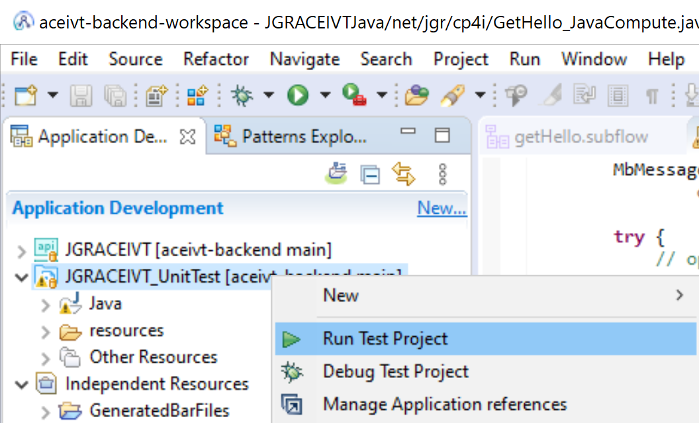
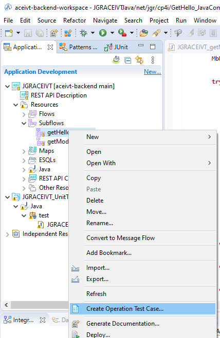

# Unit tests for demo project

Simple tests to ensure the projects compile and run successfully. The tests are run 
in the Jenkins build in the "UnitTest" stage, and can be run locally in the toolkit
by selecting the "Run Test Project" option for the project:

Further testing needed in other pipeline stages (after Jenkins completes), but these tests should ensure the code has no syntax errors.

## Test creation notes

Created using the toolkit wizard as shown:

followed by customization for the expected output.
